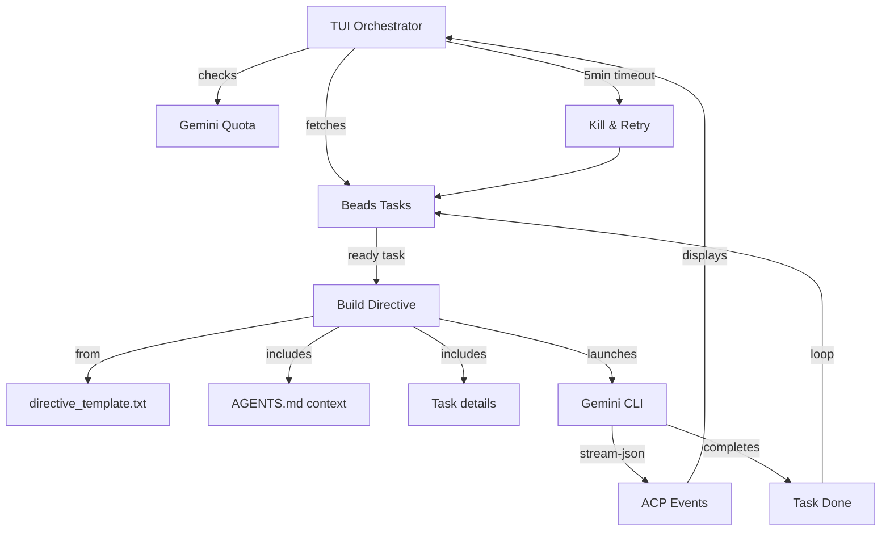

# Machinator - Autonomous Agent Orchestration System

Machinator is a TUI-based orchestrator that uses Gemini AI to automatically work through tasks managed by [beads](https://github.com/steveyegge/beads). It handles task discovery, agent directives, quota management, and continuous operation.

## The Story: Built by Agents, For Agents

**Machinator was bootstrapped and developed by the very multi-agent system it creates.**

### Inspiration

This project owes its existence to Steve Yegge's [Gas Town](https://github.com/steveyegge/gastown) and [Beads](https://github.com/steveyegge/beads). Gas Town is an impressive multi-agent orchestration system, and after reading Steve's Medium articles about AI coordination, I was genuinely inspired. But I was also convinced it was too sophisticated for where I was starting from.

At first, I thought I needed something simpler. But after working on Machinator's architecture, I now realize Gas Town is probably not that far from MVP—there's a reason Steve built it the way he did. Still, I wanted a system I could build myself (with AI help), understand completely, and mostly learn from. Whether Machinator ends up being simpler or just differently complex remains to be seen, but the journey of building it has already been worthwhile.

Beads, meanwhile, became the foundation. Its lightweight task tracking with dependency management is exactly what agent coordination needs.

### The Practical Need

The original motivation was pragmatic: while building [FilmSchool.app](https://filmschool.app), too much time was spent babysitting AI agents instead of reviewing their work. The goal was simple: **keep agents working, 24/7, without human intervention**.

### The Bootstrap Journey

1. **Hand-written shell scripts** — A simple bash dispatch loop that fetched tasks from beads, built directives, and launched Gemini in a tmux pane.

2. **Claude Opus planning** — Worked with Claude to design the architecture and generate beads tasks for improving the bootstrap system.

3. **Gemini execution** — The bootstrap orchestrator ran Gemini agents that implemented the improvements—building a Go-based Bubble Tea TUI, adding quota management, timeout handling, and the unblocking mode.

4. **Self-improvement** — The system now orchestrates its own development. Multiple AI agents (Gemini, Claude, GPT) contribute to the codebase, coordinated through beads and guided by `AGENTS.md`.

The result: **an orchestrator built by AI agents, orchestrated by a simpler version of itself, standing on the shoulders of Gas Town and Beads.**

## Quick Start

```bash
# First-time setup (dev environment + git hooks)
./scripts/dev_setup.sh

# Initialize custom Gemini CLI (clones, builds, configures)
bazel run //:init

# Run the TUI
bazel run //:tui
```

## Architecture



## How It Works

### 1. Task Discovery

The orchestrator queries beads for work:

- First checks for in-progress tasks assigned to this agent
- Then queries `bd ready` for unblocked, available tasks
- Skips tasks that recently failed (5-minute cooldown)

### 2. Unblocking Mode

When no ready tasks are available but blocked tasks exist, machinator enters **unblocking mode**:

- Uses `templates/unblocking_directive.txt` instead of the normal template
- Instructs the agent to analyze dependency chains and blockers
- Agent can update task statuses, create subtasks, or resolve blockers
- Prevents the common "everything is blocked" deadlock situation

This ensures continuous progress even when task dependencies get tangled.

### 3. Directive Building

For each task, machinator builds an instruction prompt:

1. Loads `templates/directive_template.txt`
2. Injects task context from `bd show <task-id>`
3. Injects project context from `AGENTS.md`
4. Substitutes variables: `{{.AgentName}}`, `{{.TaskID}}`, `{{.TaskContext}}`, `{{.ProjectContext}}`

### 4. Gemini Execution

Launches Gemini with the directive:

```bash
gemini --yolo --output-format stream-json "<directive>"
```

The TUI streams and displays events:

- 💭 **Thinking** — model reasoning
- 🔧 **Tool use** — file reads, shell commands, etc.
- ✅ **Results** — tool outputs
- ❌ **Errors** — failures and issues

### 5. Monitoring & Resilience

- **Quota checks** — periodic API quota monitoring
- **Inactivity timeout** — kills stuck processes after 5 minutes of no events
- **Failed task cooldown** — skips failed tasks for 5 minutes before retry
- **Continuous operation** — automatically picks up next task after completion

## TUI Interface

```
╭─────────────────────────────────────────────────────────────────────╮
│ 🤖 Machinator  Agent: Gemini-01  Quota: ████████░░ 80%  Cycle: 12   │
├──────────────┬──────────────────────────────────────────────────────┤
│ 📋 Tasks (5) │ 🤖 Agent Activity                                    │
│              │                                                      │
│ ⚡ abc ◀     │ [14:32:01] 💭 Analyzing task requirements...         │
│ ⏸ def       │ [14:32:05] 🔧 read_file: src/main.go                  │
│ ⏸ ghi       │ [14:32:08] ✅ File read successfully (234 lines)     │
│ ✓ jkl       │ [14:32:12] 🔧 run_shell_command: go test ./...        │
│              │ [14:32:15] ✅ All tests passed                       │
├──────────────┴──────────────────────────────────────────────────────┤
│ q: quit  e: execute  ↑↓: scroll  Enter: details  r: raw  ?: help   │
╰─────────────────────────────────────────────────────────────────────╯
```

**Key bindings:**

- `q` — Quit (with confirmation if Gemini running)
- `e` — Execute next ready task
- `↑↓` — Scroll through events
- `Enter` — View event details
- `r` — Toggle raw JSON view
- `Tab` — Switch panel focus

## Configuration

### Environment Variables

- `BD_AGENT_NAME` — Agent identifier (default: "Gemini-01")

### Templates

Edit `templates/directive_template.txt` to customize agent behavior. The template uses Go text/template syntax with these variables:

| Variable              | Description                   |
| --------------------- | ----------------------------- |
| `{{.AgentName}}`      | Agent identifier              |
| `{{.TaskID}}`         | Current task ID               |
| `{{.TaskContext}}`    | Output of `bd show <task-id>` |
| `{{.ProjectContext}}` | First 100 lines of AGENTS.md  |

## Development

### Prerequisites

- Go 1.24+
- Bazel
- [beads](https://github.com/steveyegge/beads) (`bd` CLI)
- Gemini CLI

### Setup

```bash
# Clone and setup
git clone <repo>
cd machinator
./scripts/dev_setup.sh

# Build
bazel build //:tui

# Run
bazel run //:tui

# Run in debug mode (no TUI, prints diagnostics)
bazel run //:tui -- --debug
```

### Project Structure

```
.
├── orchestrator/                # Go source code
│   ├── tui.go                   # Main TUI (Bubble Tea)
│   ├── acp_events.go            # Gemini stream-json parser
│   ├── quota_check.go           # API quota management
│   └── tui_helper.go            # Helper functions
├── templates/                   # Agent directive templates
│   ├── directive_template.txt   # Main agent instructions
│   ├── unblocking_directive.txt # Unblocking mode template
│   └── setup_go_env.sh          # Go environment script
├── scripts/
│   ├── dev_setup.sh             # Development environment setup
│   └── hooks/                   # Git hooks (beads + buildifier)
├── BUILD                        # Bazel build (alias to //orchestrator:tui)
├── MODULE.bazel                 # Bazel module dependencies
├── go.mod / go.sum              # Go dependencies
└── AGENTS.md                    # Agent instructions for this project
```

## Design Principles

1. **Autonomous** — Runs indefinitely, picking up tasks as they become ready
2. **Observable** — TUI shows real-time agent activity and events
3. **Resilient** — Timeouts, retries, and graceful error handling
4. **Quota-aware** — Respects API limits, waits when exhausted
5. **Task-granular** — Works best with 2-5 minute tasks
6. **Beads-native** — Deep integration with beads issue tracking
