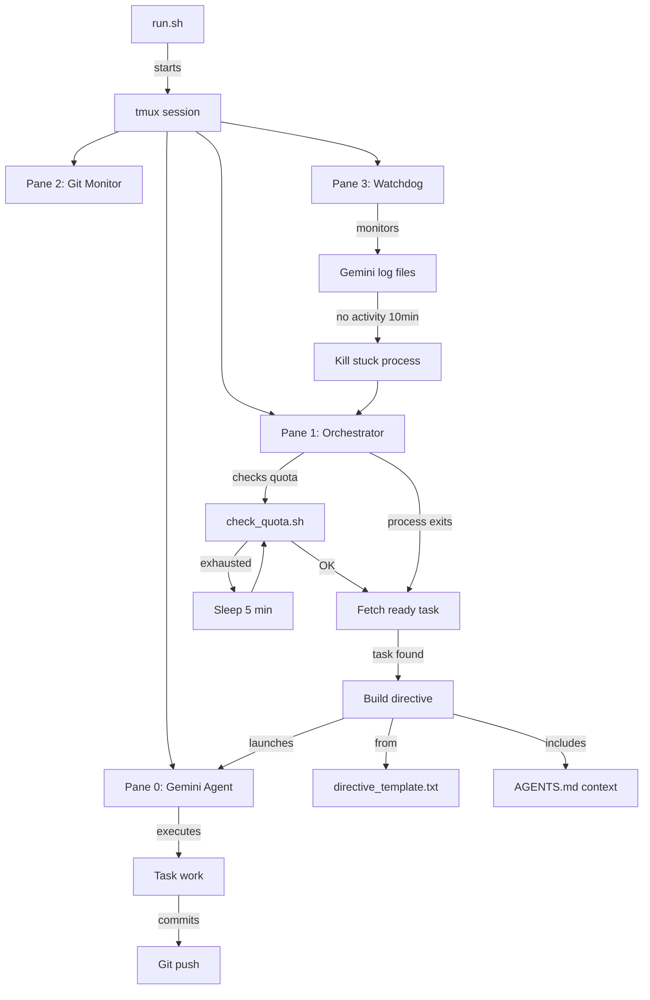

# Machinator - Autonomous Agent Orchestration System

Machinator is an autonomous agent system that uses Gemini AI to automatically work through tasks in the beads (bd) task management system. It handles quota management, task assignment, and continuous operation.

## Quick Start

```bash
# Start the autonomous agent system
./bootstrap/run.sh

# Stop everything
./bootstrap/stop.sh
```

## Architecture



## Components

### Control Scripts

**run.sh**

- Starts tmux session or attaches if already running
- Entry point for the autonomous agent system

**stop.sh**

- Kills tmux session
- Cleans up all related processes (orchestrator, gemini, watchdog)

### Core Scripts

**orchestrator_with_quota.sh**

- Main orchestration loop
- Manages quota checking and task assignment
- Builds agent directives from template
- Monitors Gemini process completion
- Runs continuously (10,000 cycles max)

**check_quota.sh**

- Checks Gemini API quota using `--dump-quota` flag
- Returns 0 if quota available (>2%)
- Returns 1 if exhausted
- Extracts reset time for smart waiting

**gemini_watchdog.sh**

- Monitors Gemini log file activity
- Kills stuck processes after 10 minutes of inactivity
- Prevents infinite hangs

**setup_go_env.sh**

- Sets Go environment variables to use local caches
- Prevents permission errors from macOS security restrictions

**tmux_agent_setup.sh**

- Creates 2x2 tmux layout
- Configures all panes with appropriate commands
- Sets up monitoring and control panels

### Configuration

**directive_template.txt**

- Agent instruction template
- Includes protocols, environment setup, and task context
- Variables substituted at runtime: `$AGENT_NAME`, `$TASK_ID`, `$TASK_CONTEXT`, `$PROJECT_CONTEXT`

## How It Works

### 1. Startup

```bash
./bootstrap/run.sh
```

Creates tmux session with 4 panes:

- **Top-left**: Gemini agent executing tasks
- **Top-right**: Orchestrator logs
- **Bottom-left**: Git commit history (refreshes every 30s)
- **Bottom-right**: Watchdog monitoring

### 2. Orchestration Loop

```
┌─────────────────────────────────────┐
│  Check Quota                        │
│  ├─ OK → Continue                   │
│  └─ Exhausted → Sleep 5 min         │
└─────────────────────────────────────┘
           ↓
┌─────────────────────────────────────┐
│  Find Ready Task                    │
│  ├─ In-progress task for agent      │
│  └─ Next ready task from queue      │
└─────────────────────────────────────┘
           ↓
     ┌─────┴─────┐
     │           │
  Found?        None
     │           │
     ↓           ↓
┌─────────┐  ┌──────────────────────┐
│ Execute │  │ Tasks exist?         │
│ Task    │  │ ├─ Yes → UNBLOCK     │
└─────────┘  │ └─ No → Sleep        │
             └──────────────────────┘
                      ↓
             ┌──────────────────────┐
             │ UNBLOCKING MODE      │
             │ ├─ Analyze blockers  │
             │ ├─ Update statuses   │
             │ ├─ Create subtasks   │
             │ └─ Document issues   │
             └──────────────────────┘
                      ↓
             (Loop back to Find Ready Task)
```

### 3. Quota Management

- **Check before each task**: Prevents starting work that will fail
- **2% threshold**: Maximizes API usage before sleeping
- **5-minute polling**: Catches early quota refreshes
- **Silent waiting**: No spam logs during exhaustion

### 4. Watchdog Protection

- Monitors `/Users/bryantinsley/.gemini/tmp/**/*.json`
- Checks every 60 seconds
- Kills Gemini if no log activity for 10 minutes
- Orchestrator detects death and restarts with next task

## Environment Variables

Set in `tmux_agent_setup.sh`:

- `BD_AGENT_NAME`: Agent identifier (default: "Gemini-01")
- `BD_MAX_CYCLES`: Maximum orchestration loops (default: 10000)
- `BD_SLEEP_DURATION`: Sleep between cycles (default: 60s)
- `BD_LOG_FILE`: Orchestrator log path
- `BD_GEMINI_PANE`: Tmux pane for Gemini

## Troubleshooting

### Agent not starting tasks

Check orchestrator logs:

```bash
tail -f /tmp/bd_orchestrator_Gemini-01.log
```

### Quota issues

Manually check quota:

```bash
./machinator/check_quota.sh
echo $?  # 0 = OK, 1 = exhausted
```

### Stuck processes

Watchdog should handle this automatically. Manual cleanup:

```bash
./machinator/stop.sh
```

### Syntax errors

Validate orchestrator script:

```bash
bash -n machinator/orchestrator_with_quota.sh
```

## Files

```
machinator/
├── README.md                    # This file
├── run.sh                       # Start/attach to session
├── stop.sh                      # Stop all processes
├── orchestrator_with_quota.sh   # Main orchestration loop
├── check_quota.sh               # Quota checking
├── gemini_watchdog.sh           # Process monitoring
├── setup_go_env.sh              # Go environment setup
├── tmux_agent_setup.sh          # Tmux layout configuration
├── directive_template.txt       # Agent instruction template (normal mode)
└── unblocking_directive.txt     # Agent instruction template (unblocking mode)
```

## Design Principles

1. **Autonomous**: Runs indefinitely without human intervention
2. **Quota-aware**: Intelligently manages API limits
3. **Resilient**: Watchdog prevents infinite hangs
4. **Observable**: Tmux layout shows all activity
5. **Granular**: Tasks are 2-5 minutes each for steady progress
6. **Hierarchical**: Large tasks decomposed into subtasks
