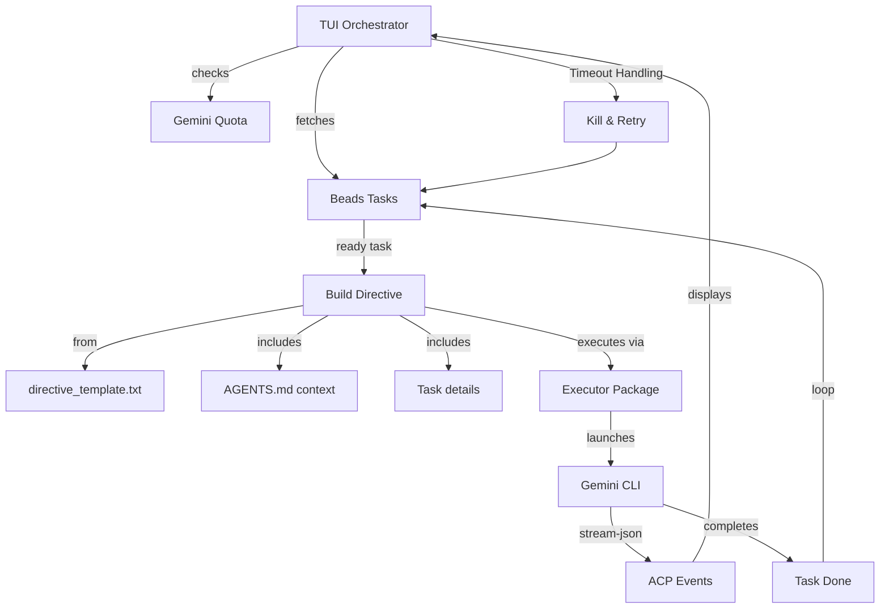

# Machinator - Autonomous Agent Orchestration System

Machinator is a TUI-based orchestrator that uses Gemini AI to automatically work through tasks managed by [beads](https://github.com/steveyegge/beads). It handles task discovery, agent directives, quota management, and continuous operation.

## The Story: Built by Agents, For Agents

**Machinator was bootstrapped and developed by the very multi-agent system it creates.**

### Inspiration

This project owes its existence to Steve Yegge's [Gas Town](https://github.com/steveyegge/gastown) and [Beads](https://github.com/steveyegge/beads). Gas Town is an impressive multi-agent orchestration system, and after reading Steve's Medium articles about AI coordination, I was genuinely inspired. But I was also convinced it was too sophisticated for where I was starting from.

At first, I thought I needed something simpler. But after working on Machinator's architecture, I now realize Gas Town is probably not that far from MVP—there's a reason Steve built it the way he did. Still, I wanted a system I could build myself (with AI help), understand completely, and mostly learn from. Whether Machinator ends up being simpler or just differently complex remains to be seen, but the journey of building it has already been worthwhile.

Beads, meanwhile, became the foundation. Its lightweight task tracking with dependency management is exactly what agent coordination needs.

### The Practical Need

The original motivation was pragmatic: while building [FilmSchool.app](https://filmschool.app), too much time was spent babysitting AI agents instead of reviewing their work. The goal was simple: **keep agents working, 24/7, without human intervention**.

### The Bootstrap Journey

1. **Hand-written shell scripts** — A simple bash dispatch loop that fetched tasks from beads, built directives, and launched Gemini in a tmux pane.

2. **Claude Opus planning** — Worked with Claude to design the architecture and generate beads tasks for improving the bootstrap system.

3. **Gemini execution** — The bootstrap orchestrator ran Gemini agents that implemented the improvements—building a Go-based Bubble Tea TUI, adding quota management, timeout handling, and the unblocking mode.

4. **Self-improvement** — The system now orchestrates its own development. Multiple AI agents (Gemini, Claude, GPT) contribute to the codebase, coordinated through beads and guided by `AGENTS.md`.

The result: **an orchestrator built by AI agents, orchestrated by a simpler version of itself, standing on the shoulders of Gas Town and Beads.**

## Project Status

Machinator is under active development. Current build and test status:

- **Build:** `bazel build //backend/...`
- **Test:** `bazel test //backend/...`

### Package Overview

- `backend/internal/beads`: High-level interaction with the Beads task tracking system.
- `backend/internal/config`: Global configuration management for the Machinator orchestrator.
- `backend/internal/executor`: Logic for launching, monitoring, and triaging agent task execution.
- `backend/internal/project`: Management of project metadata and task context generation.
- `backend/internal/quota`: Monitoring and enforcement of Gemini API usage limits.
- `backend/internal/setup`: Initialization of the Machinator environment and project state.
- `backend/internal/state`: Persistent tracking of orchestration progress and agent status.
- `backend/internal/tui`: Interactive terminal user interface for monitoring and control.

## Quick Start

```bash
# First-time setup (dev environment + git hooks)
./scripts/dev_setup.sh

# Build the orchestrator
bazel build //backend/cmd/machinator:machinator

# Run the orchestrator on a specific project
./bazel-bin/backend/cmd/machinator/machinator_ run --project 1
```

## Architecture

Machinator uses a fetch-execute-loop to maintain continuous operation. The core execution logic is encapsulated in the `executor` package, which handles agent lifecycles, event streaming, and task triage.

For a detailed breakdown of the system design, see [How It Works](docs/concepts/how-it-works.md).



## TUI Interface

The interactive TUI provides several views for real-time monitoring and control:

- **Activity:** Real-time stream of agent thoughts and tool calls.
- **Agent Status:** Detailed breakdown of each agent's current task and progress.
- **Execution Log:** Historical record of completed tasks and their outcomes.

```
╭─────────────────────────────────────────────────────────────────────╮
│ 🤖 Machinator  Agent: Gemini-01  Quota: ████████░░ 80%  Cycle: 12   │
├──────────────┬──────────────────────────────────────────────────────┤
│ 📋 Tasks (5) │ 🤖 Agent Activity                                    │
│              │                                                      │
│ ⚡ abc ◀     │ [14:32:01] 💭 Analyzing task requirements...         │
│ ⏸ def       │ [14:32:05] 🔧 read_file: src/main.go                  │
│ ⏸ ghi       │ [14:32:08] ✅ File read successfully (234 lines)     │
│ ✓ jkl       │ [14:32:12] 🔧 run_shell_command: go test ./...        │
│              │ [14:32:15] ✅ All tests passed                       │
├──────────────┴──────────────────────────────────────────────────────┤
│ s: start  p: pause  x: stop  e: execute  +/-: agents  q: quit  ?: help │
╰─────────────────────────────────────────────────────────────────────╯
```

**Key bindings:**

- `s` — Start/Resume orchestration
- `p` — Pause orchestration
- `x` — Stop orchestration (kills running agents)
- `e` — Manually execute next ready task
- `+`/`-` — Increase/Decrease concurrent agent count
- `r` — Refresh tasks and quota
- `q` — Quit (with confirmation)
- `Tab` — Switch panel focus (Grid, Tasks, Activity)
- `↑`/`↓` — Scroll through activity events
- `Enter` — View event details (and toggle `r` for raw JSON in detail view)
- `?` — Show help modal

### Visual Demos

#### Orchestrator Run
Showing the orchestrator in action, executing tasks and streaming events.


#### Navigation & Screen Switching
Smooth transitions between the main task list, project details, and account management.


#### Task CRUD Operations
Editing project details and managing agent counts.


## Configuration

### Environment Variables

- `BD_AGENT_NAME` — Agent identifier (default: "CoderAgent")
- `MACHINATOR_BRANCH_PROTECTION` — Set to `pr-required` to enforce PR workflow (default: `none`)
- `MACHINATOR_POOLING_ENABLED` — Enable/disable Gemini account pooling (default: `true`)

### Templates

Edit `templates/directive_template.txt` to customize agent behavior. The template uses Go text/template syntax with these variables:

| Variable               | Description                        |
| ---------------------- | ---------------------------------- |
| `{{.AgentName}}`       | Agent identifier                   |
| `{{.TaskID}}`          | Current task ID                    |
| `{{.BranchProtection}}`| PR workflow enforcement status      |
| `{{.TaskContext}}`     | Output of `bd show <task-id>`      |
| `{{.ProjectContext}}`  | First 100 lines of AGENTS.md       |

## Development

### Prerequisites

- Go 1.24+
- Bazel
- [beads](https://github.com/steveyegge/beads) (`bd` CLI)
- Gemini CLI

### Setup

```bash
# Clone and setup
git clone <repo>
cd machinator
./scripts/dev_setup.sh

# Build (Bazel)
bazel build //backend/cmd/machinator:machinator

# Run (Bazel)
./bazel-bin/backend/cmd/machinator/machinator_ run --project 1

# Run in debug mode
./bazel-bin/backend/cmd/machinator/machinator_ run --project 1 --debug
```

### Testing

```bash
# Run all tests with Bazel
bazel test //backend/...
```

### Project Structure

```
.
├── backend/                     # Go source code
│   ├── cmd/machinator/          # Main entry point (main.go)
│   └── internal/                # Core logic
│       ├── beads/               # Beads integration
│       ├── config/              # Configuration management
│       ├── executor/            # Execution logic
│       ├── project/             # Project management
│       ├── quota/               # Quota management
│       ├── setup/               # Environment setup
│       ├── state/               # State tracking
│       └── tui/                 # TUI components
├── templates/                   # Agent directive templates
│   ├── directive_template.txt   # Main agent instructions
│   ├── unblocking_directive.txt # Unblocking mode template
│   └── setup_go_env.sh          # Go environment script
├── scripts/
│   ├── dev_setup.sh             # Development environment setup
│   └── hooks/                   # Git hooks (beads + buildifier)
├── BUILD                        # Bazel root build file
├── MODULE.bazel                 # Bazel module dependencies
├── go.mod / go.sum              # Go dependencies
└── AGENTS.md                    # Agent instructions for this project
```

## Design Principles

1. **Autonomous** — Runs indefinitely, picking up tasks as they become ready
2. **Observable** — TUI shows real-time agent activity and events
3. **Resilient** — Timeouts, retries, and graceful error handling
4. **Quota-aware** — Respects API limits, waits when exhausted
5. **Task-granular** — Works best with 2-5 minute tasks
6. **Beads-native** — Deep integration with beads issue tracking
