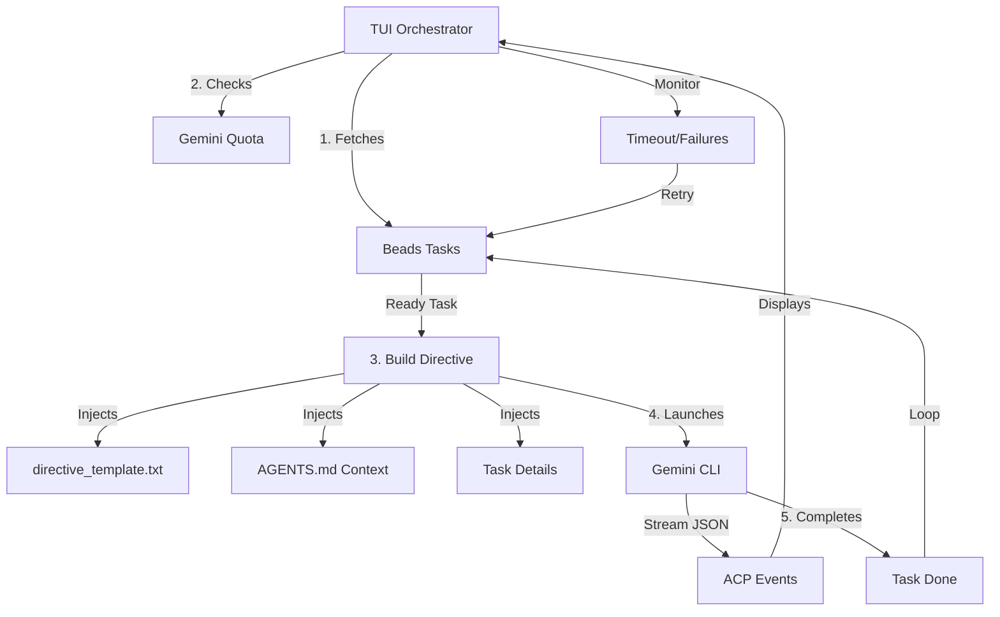

# How Machinator Works

Machinator is an autonomous orchestration system designed to keep AI agents working continuously on tasks. It bridges the gap between a task manager ([Beads](https://github.com/steveyegge/beads)) and a powerful LLM ([Gemini](https://ai.google.dev/)).

## High-Level Architecture

## The Core Loop

Machinator operates in a continuous cycle:

1.  **Fetch**: Queries Beads for the next "ready" task.
2.  **Build**: Injects task details and project rules into a directive template.
3.  **Run**: Launches the Gemini CLI with the generated directive.
4.  **Monitor**: Streams real-time events (thinking, tool use) to the TUI.
5.  **Complete**: Once the agent finishes, the cycle starts over immediately.

---

## Key Concepts

### 1. Beads (The Task Tracker)
[Beads](https://github.com/steveyegge/beads) is the source of truth for all work. Machinator uses it to:
- Find tasks that are unblocked and ready for work.
- Respect dependencies (don't start B until A is done).
- Track progress and status changes.

### 2. Directives (The Instructions)
A **Directive** is the prompt sent to the AI agent. It is built dynamically by combining:
- **`directive_template.txt`**: The "how to behave" instructions.
- **`AGENTS.md`**: The project-specific rules and standards.
- **Task Context**: The specific details of what needs to be done.

### 3. Quota Management
To avoid hitting API limits, Machinator:
- Monitors Gemini API usage in real-time.
- Pauses execution if quota is exhausted.
- Automatically resumes when more quota becomes available.

### 4. Unblocking Mode
If no tasks are "ready" but many are "blocked", Machinator enters **Unblocking Mode**. It instructs an agent specifically to look at the blockers and try to resolve them (e.g., by updating statuses or completing a prerequisite).

---

## Resilience & Autonomy

- **Timeouts**: If an agent stops responding for 5 minutes, Machinator kills the process and retries.
- **Cooldowns**: If a task fails, it's put on a 5-minute cooldown to prevent "infinite failure loops".
- **Continuous Operation**: The system is designed to run in a background terminal (or tmux) 24/7.
