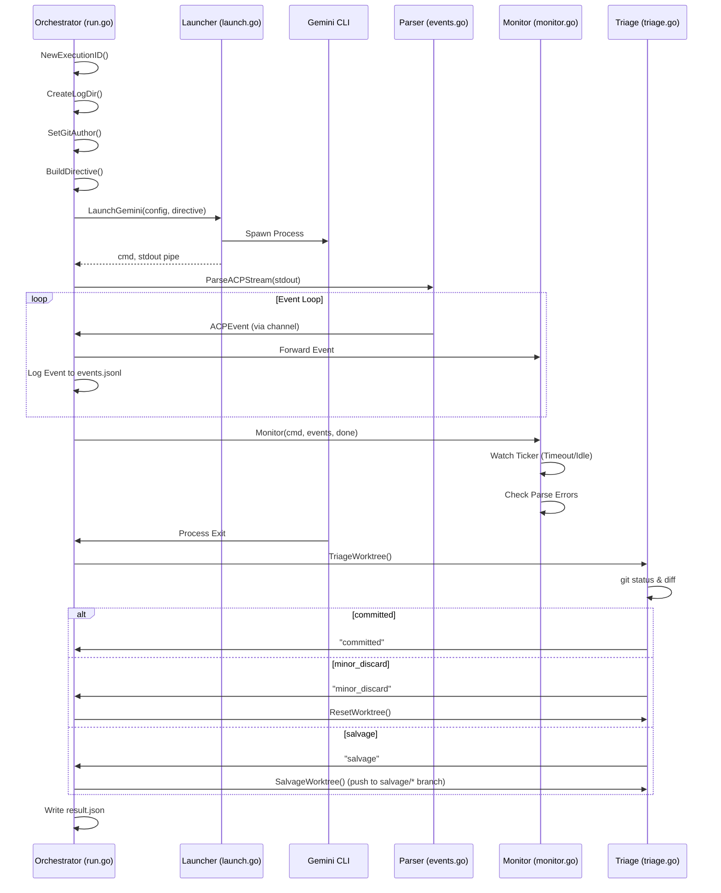

# Executor Package Architecture

The `executor` package is the core engine of Machinator. It is responsible for launching Gemini CLI instances, monitoring their execution, triaging the results, and ensuring the worktree is left in a consistent state.

## 1. Overview

The executor acts as a supervisor for Gemini. Its primary responsibilities are:
- **Environment Setup**: Preparing the worktree, setting git identity, and building the execution directive.
- **Process Management**: Launching Gemini with appropriate flags and environment variables.
- **Real-time Monitoring**: Parsing the JSON event stream from Gemini to track progress and intervene if fatal errors or timeouts occur.
- **Triage and Cleanup**: Analyzing the worktree after Gemini exits to determine if changes should be committed, discarded, or salvaged.
- **Persistence**: Logging execution details, events, and results for later analysis.

## 2. Component Diagram

The package is composed of several specialized modules:

- **`executor.go` (Types)**: Defines the core interfaces and data structures (`ExecutionConfig`, `ExecutionResult`, `Logger`).
- **`run.go` (Orchestrator)**: Contains `ExecuteTask`, the main entry point that coordinates all other components.
- **`launch.go` (Process Launcher)**: Handles `exec.Command` creation, environment variable injection, and pipe management.
- **`events.go` (Event Parser)**: Parses the line-delimited JSON stream (ACP stream) from Gemini into structured `ACPEvent` types.
- **`monitor.go` (Health Monitor)**: A blocking supervisor that watches for `MaxRuntime`, `IdleTimeout`, and consecutive parse errors.
- **`triage.go` (Worktree Analyst)**: Analyzes git status/diff and determines the fate of uncommitted changes (`clean`, `committed`, `minor_discard`, `salvage`).
- **`trace.go` (Utilities)**: Handles execution ID generation, log directory creation, and git author configuration.
- **`retry.go` (Resilience)**: Implements retry logic with exponential-ish backoff and worktree resets between attempts.
- **`directive.go` (Prompt Builder)**: Assembles the `directive.md` file by injecting task context into templates.
- **`stats.go` (Analytics)**: Tracks cumulative statistics like total duration, success rate, and completed tasks.
- **`beads_integration.go` (Task Sync)**: Interfaces with the `bd` CLI to close or block tasks based on execution results.

## 3. Execution Flow

The following diagram illustrates the step-by-step execution of a task:

## 4. Error Handling

The executor employs several strategies to handle failures:

| Error Condition | Detection Mechanism | Resolution |
|-----------------|---------------------|------------|
| **Max Runtime** | `monitor.go` (Ticker) | Kill process, return `max runtime exceeded` error. |
| **Idle Timeout** | `monitor.go` (Last event time) | Kill process, return `idle timeout` error. |
| **Parse Errors** | `monitor.go` (Text pattern matching) | Kill process after 3 consecutive "Command rejected" errors. |
| **Sandbox Violation** | Gemini CLI Exit Code | Captured in `ExecutionResult`, logged in `result.json`. |
| **Triage Failure** | `triage.go` (Git command error) | Log error, attempt to salvage worktree if possible. |

## 5. Configuration: `ExecutionConfig`

The `ExecutionConfig` struct controls the behavior of the execution:

- `GeminiPath`: Path to the `gemini` binary.
- `HomeDir`: The virtualized home directory (important for sandbox isolation).
- `WorktreeDir`: The directory where the code lives and where Gemini will run.
- `RepoDir`: The root of the git repository.
- `Model`: The LLM model to use (e.g., `gemini-2.0-flash-exp`).
- `TaskID`: The identifier for the task being executed.
- `AgentID`: Integer ID for the agent (used for git author and logging).
- `IdleTimeout`: Duration to wait for activity before killing the process.
- `MaxRuntime`: Total time allowed for the task.
- `SandboxEnabled`: Whether to enforce macOS Seatbelt/sandbox restrictions.

## 6. Integration Points

- **Assigner**: Calls `ExecuteWithRetry` after selecting a task for an agent.
- **State**: `ExecutionStats` are updated after every run to track progress.
- **TUI**: Receives log events via the `Logger` interface to display real-time status to the user.
- **Beads**: `beads_integration.go` is used to finalize task status in the issue tracking system.

## 7. Future Work

- **Account Rotation**: Implementation of credential cycling for long-running sessions.
- **PR Mode**: Automated creation of Pull Requests instead of direct pushes to task branches.
- **Enhanced Triage**: More sophisticated analysis of "salvageable" work (e.g., partial test success).
- **Resource Limits**: Integration with cgroups or similar to limit CPU/Memory usage.
- **Streaming UI**: Better support for streaming partial diffs to the TUI.
